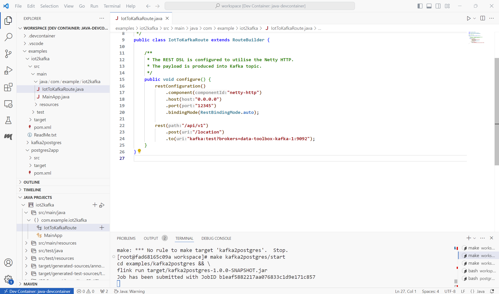

# data-engineering-example
The `data-engineering-example` is an example GitHub project for anyone who has interest on data engineering.

## Setup

Clone the Git repository from the GitHub. Then go into the root directory of the Git Project. There
are directories called `java` and `python`. Those two directories contains devcontainers for Java and
Python.

Create a Docker network with `make docker/network/create`. Then start the Docker compose setup with
`make docker/compose/up`.

Start three VSCode instances with `code .`, `code java` and `code python` commands. In the Java and
Python VScode instances run `ctrl+shift+p` and build the devcontainers.

Then create resources with `resources/create`.

At this point, you should have three VSCode instances, one in your host, one Java devcontainer and one
Python devcontainer. Then the Docker compose will start: Grafana, Kafka, Kafka Exporter, Postgres,
Prometheus and Superset containers.

In the Grafana there should be a Prometheus and a Postgres datasources, and a dashboard. In the Superset
there should be a database connection to the Postgres database.

All of these containers are in a same Docker network. What this means in practice, is the fact that all
of them are able to communicate with each other. Whatever Java or Python application you develop, you
can communicate with other containers.

Now go into the Java devcontainer. Start Flink cluster with `make flink/start`. Then start the Camel application for ingesting the data from the IoT devices with `make iot2kafka/start`. Then start the Flink application that
is calculating the moving average and enriching the original data with filtered data with `make kafka2postgres/start`. Then start the another Camel application that exposes the REST API for the enriched data with
`make postgres2app/start`.

Then go into the Python devcontainer. Star the IoT simulator with `make iot-simulator/start`. By default it
will generate five IoT devices and they start sending their location every second into the system.

Both devcontainers do include a lot of capabilities that goes far beyond the needs of this example. This is part of my own personal `data-toolbox` that I have developed for my personal usage.

Then you can go with your browser and go into Grafana at `http://localhost:3000`. The basic authentication
is in use and the credentials are `admin` and `admin`.

First, check the datasources, and you should see the `postgres` and `prometheus` datasources.

Second, check the dashboards, and you should see a `Non-filtered Path vs Filtered Path` on the list.

Click the dashboard, and you should see the geomap panel in the dashboard.

Click the Kebab menu (the three dots that are vertically aligned), and you can select `view` to see the panel
in bigger size.

Note: in the screenshots, the time interval is different, therefore the paths are different. The Grafana dashboard is refreshing every 5 seconds, and it is presenting five minutes worth of data for each IoT device (id).

### Optional Setup

If you like to explore the Superset, then you can go into `http://localhost:8088` and log into the Superset.

Go into `Settings` at upper right corner, and select `Database Connections`.

Go into `Datasets` on the top, and fill in the form like in the screenshot below. Click the
`CREATE DATASET AND CREATE CHART`. Then you can create chart such as scatter plot, line chart
or many others.

Go into `SQL` on the top and select `SQL Lab`. Then you can make queries to the Postgres database.

## Example Case Extract Transform Load

In this example, that you did setup up on the above, the scenario has IoT devices and a system that processes the data from the IoT
devices. The IoT device is sending data via HTTP request into REST API. The data includes id,
timestamp, longitude and latitude.

The system that processes the data is roughly an ETL pipeline. There are four components:
Apache Camel, Apache Kafka, Apache Flink and PostgreSQL database. The Apache Camel supports
most of the Enterprice Integration Patterns which makes it perfect for integrating to
southbound and northbound interfaces. The Apache Kafka is a distributed event streaming platform
which makes it perfect for decoupling your system. The Apache Flink is a distributed processing
engine for stateful computations which makes it perfect for transforming data. The PostgreSQL
is the de facto open source SQL database and simply perfect for storing the data.

The system is exposing the data from the PostgreSQL database into three different options: Grafana,
Apache Superset and via REST API to any generic web application.

The IoT device sends data into the system, it is ingested at Netty HTTP Server. Then it is routed into a Kafka Producer which produces it into the Kafka topic. Then a Kafka Consumer in the Flink is consuming the data and starts to calculate a moving average for the longitude and latitude coordinates. The filtered longitude and latitude coordinates are enriched into the data, and after that the enriched data is inserted into a table in the Postgres database. Then the Grafana dashboard is pulling the data from the Postgres database, and the user is able to see the IoT device location and the filtered location on a map in the Grafana dashboard.

It is noteworthy to mention that in this example the most time consuming parts are naturally the REST APIs, especially the northbound one. Developing a REST API is time consuming activity as every resource needs to be managed properly, and for every request and response there must be error handling in place. However, in this example a lot of small details are missing that you would find from a production version.

## Data Engineering Versus Software Engineering

Data engineering has been around for many years by now, but still it is difficult for people to understand the
differences between data engineering and software engineering. This example was built to showcase the different
view that a data engineer has compared to a software engineer.

As you have noticed, I haven't really developed any new software in this example. I have barely written some Python
code for a simulator, setting up the resources, and then some Java code for configuring Camel and Flink. The data engineer is only interested of the data. For a data engineer, it does not really matter what tools to use, as long as they fulfill the requirements and complete the task.

The setup that I put together here is very powerful and flexible for many kinds of data engineering tasks. Note, it is not a production setup as that requires building Docker images that contains the applications. But when you are investigating the data and developing the application, you can develop your idea like this. It enables for you to
integrate into many kinds of systems.

A software engineer would start writing code. Most likely it would lead into situation where similar logic is built
with completely customized implementations. It takes time and effort, and especially manpower. The benefits that you are after may not never be gained after all.

If we think about the tools that I have in this setup, it would take hundreds of software engineers and many, many years to build the similar capabilities.

With the tooling already available, companies get started much faster, and they can focus on the actual data.
